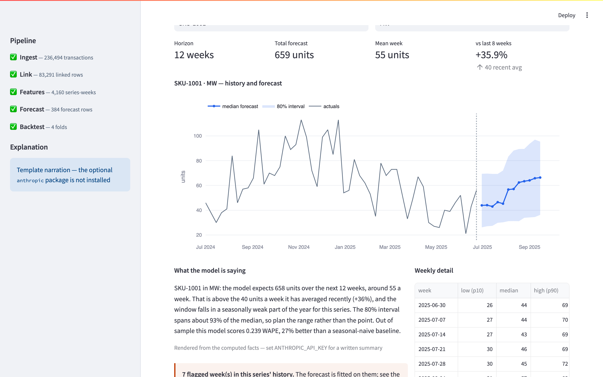
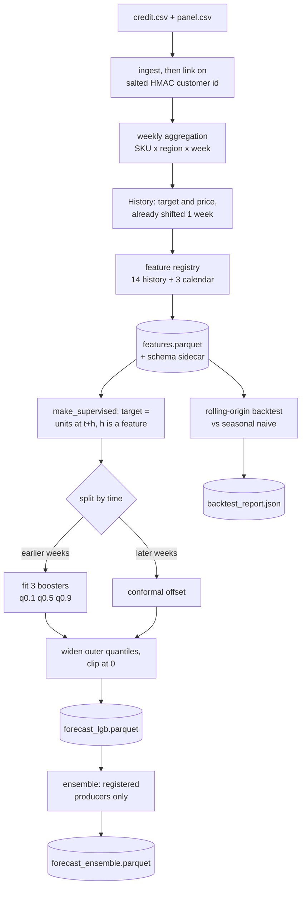
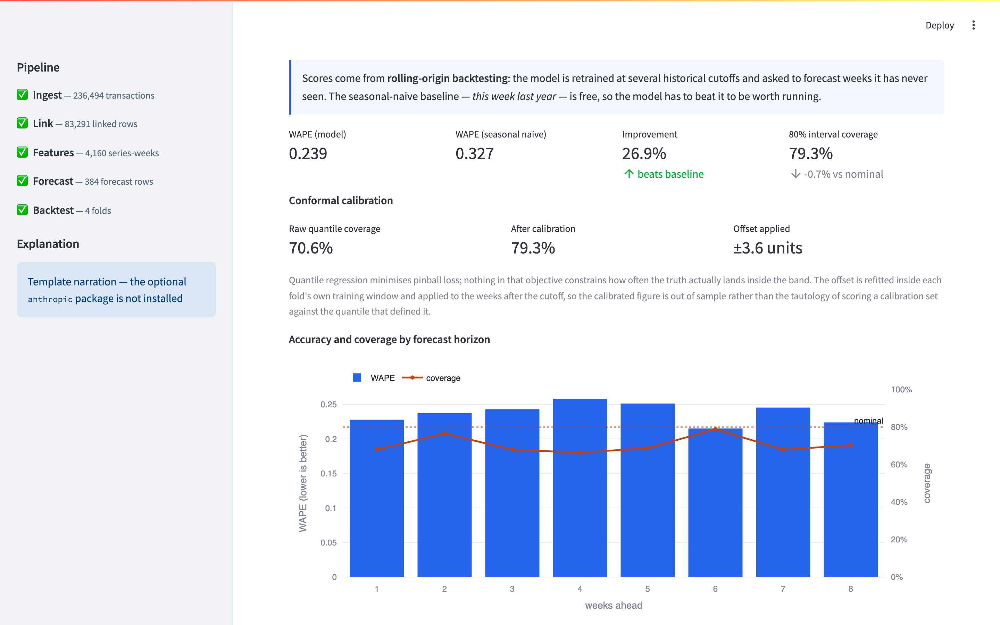
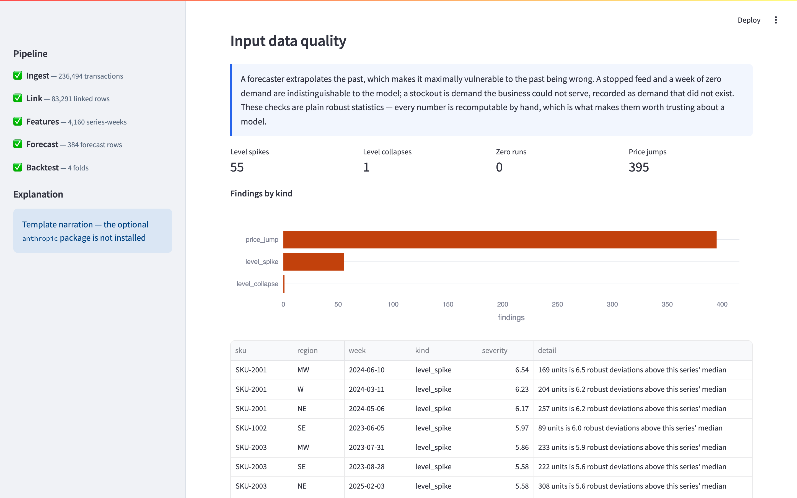

# SKU × Region Demand Forecasting

Weekly unit-demand forecasts for every SKU in every region, as a **calibrated
prediction interval rather than a single number** — served over an API, drawn in a
dashboard, scored against a baseline it has to beat. LightGBM quantile regression,
conformal interval calibration, a rolling-origin backtest, FastAPI, Streamlit. The
whole pipeline runs from a clean clone in thirteen seconds, with no credentials and
no dataset to download.

## The score

Four rolling-origin folds, horizon 8 weeks, scored only on weeks after each fold's
cutoff. `python -m src.evaluation.backtest --folds 4 --horizon 8` prints this and
writes it to `backtest_report.json`:

```
cutoff         rows     WAPE    naive    lift   cover     cal
--------------------------------------------------------------
2024-11-11      256    0.233    0.341  31.9%   68.8%   73.4%
2025-01-06      256    0.244    0.316  22.9%   71.9%   83.2%
2025-03-03      256    0.243    0.330  26.4%   69.9%   78.5%
2025-04-28      256    0.236    0.320  26.1%   71.9%   82.0%
--------------------------------------------------------------
mean                   0.239    0.327  26.9%   70.6%   79.3%
```

Two claims, and they are the only two worth arguing about. **WAPE 0.239 against a
seasonal-naive 0.327 — 26.9% better** than "the same week last year", out of sample.
And **the 80% interval covers 79.3%, not 70.6%**: the raw quantiles were overconfident
by nine points, conformal calibration fixed it, WAPE did not move.



## Run it

The local path is the one that has actually been exercised:

```bash
python3.11 -m venv .venv && source .venv/bin/activate
pip install -r requirements-core.txt -r requirements-dev.txt
brew install libomp     # macOS only — see the caveats below
python -m scripts.run_pipeline --weeks 130 --horizon 12   # data → forecasts
python -m src.evaluation.backtest --folds 4 --horizon 8   # the table above
python -m pytest tests/ -q                                # 289 tests, ~5s
uvicorn src.serving.app:app --port 8000                   # API on :8000
streamlit run streamlit_demo.py                           # dashboard on :8501
```

That pipeline run is 13.1 s end to end: 236,494 generated transactions, linked to
83,291 panel-matched rows, aggregated to 4,160 SKU × region weeks, reshaped to
47,424 supervised rows, three boosters fitted, conformal offset calibrated.

`POST /forecast` returns `q0.1 / q0.5 / q0.9` per week for a `(sku, region)`,
`POST /explain` adds a sentence a planner can act on, `GET /anomalies` lists suspect
input weeks, `GET /models` names the forecasters this build implements. The settings
worth knowing are `DATA_DIR` (default `./data`, git-ignored) and `HASH_SALT`, whose
default is public and so protects nothing; the rest live in `src/config.py`, and none
is required to run the system end to end.

**Two reproducibility caveats.** LightGBM's wheel bundles no OpenMP runtime, so
without `brew install libomp` (Linux: `libgomp1`) `import lightgbm` dies with a
`dlopen` error about `libomp.dylib` that looks nothing like a missing system package,
and pytest stops with two collection errors rather than a test failure. And the fold
table reproduces exactly on the machine it was measured on (Apple M1 Pro, Python
3.12), but LightGBM is not bit-identical across platforms and thread counts, so
expect the third decimal of WAPE to move elsewhere — the `PASS` gates are deliberately
wide (beat naive at all, coverage within ±15pp). Separately, `make up` wires a seed
job, the API on :8360 and the dashboard on :8361 out of `docker-compose.yml` and a
two-stage `docker/Dockerfile`, but Docker was unavailable where this was built, so
**the image has never been built**; treat that path as unverified.

## From a transaction to a forecast row



Everything under `DATA_DIR` is derived and git-ignored; the two CSVs in
`examples/sample_data/` document the expected input schema and are never written to
— a separation that exists for a specific reason, below.

## A feature that sees the future is unwritable

A trailing average computed on the raw target column includes the week it is meant
to describe. That bug existed here, was fixed, and was pinned with tests — but tests
enumerate the columns that exist *today*: the next person adds a feature by hand,
reaches for `df["units_sold"].rolling(4)`, and the suite still passes because it has
never heard of their column.

So features are not written against the DataFrame at all. They are declared in
`src/features/registry.py` and handed a `History`, whose only data are the target
and price series **already shifted one period** and grouped by series:

```python
@history_feature("roll_4w_mean", "Mean weekly units over the 4 weeks before this one")
def _roll_4w(h: History) -> pd.Series:
    return h.mean(4)
```

`History.lag(0)` raises `ValueError: lag must be at least 1 week back, got 0`, and no
accessor returns the current week: the leaking line is not discouraged by this
interface, it is unwritable. Features that legitimately describe the row's own week —
week of year, month, year — are a separate, short, named list. And because
`test_no_leakage.py` and `test_feature_registry.py` both *enumerate the registry*, a
feature registered tomorrow inherits the change-the-last-week invariance check.

**Re-proved by injection, not asserted.** Change `History.lag`'s
`self._units.shift(n - 1)` to `shift(n - 2)`, so `lag(1)` returns the row's own
week, and 8 tests fail: 5 in `test_no_leakage.py` (lag identity, first row has no
history, cross-series bleed, the filled-gap case, no feature equals its own
target), 1 in `test_split_boundary.py` — a fold run with fit and predict
intercepted, asserting the captured panels are disjoint — and 2 in
`test_feature_registry.py` (the current week is unreachable). Revert, and 289 pass.
The tests detect what they claim to detect.

## Making the 80% interval mean 80%

Quantile regression minimises pinball loss, and nothing in that objective constrains
how *often* the truth lands inside the band. It landed inside 70.6% of the time
against a nominal 80%, which is the more dangerous of the two headline numbers: a
planner sizing safety stock against a band narrower than advertised is told the tail
risk is smaller than it is.

`src/evaluation/conformal.py` implements conformalised quantile regression (Romano,
Patterson & Candès, 2019): on a disjoint calibration slice, score each row by how
far outside the band it fell, `E = max(lo - y, y - hi)`; take the
finite-sample-corrected `(1-α)(1 + 1/n)` empirical quantile of those scores; widen
both ends by it, clipped at zero so calibration only ever widens. The split is by
time, never at random — a random split puts a week's neighbours on both sides of the
boundary and quietly restores the leak the rest of this repository is built to
avoid.

The backtest refits the offset inside each fold's own training window, so **70.6% →
79.3% is out of sample**, not the tautology of scoring a calibration set against the
quantile that defined it. The caveat worth stating: conformal coverage assumes
exchangeability, which a time series does not satisfy — the calibration slice is the
recent past, the rows predicted are the future — which is why the effect is measured
rather than quoted from the theorem.



## An artifact has to name its producer

The ensemble used to hold a literal `{model: filename}` dict and load whatever was on
disk, so a committed `forecast_deepar.parquet` was blended into every local run — 36
rows from a dead eight-transaction toy dataset, written by **no code in this
repository**, because the DeepAR trainer has only ever been a stub that raises.
`src/models/registry.py` makes "which models exist" a fact about the code: a
`forecast_*.parquet` that no registered, implemented forecaster produces is an
orphan, named in the log, surfaced at `GET /models` and in the dashboard sidebar,
and left out of the blend.

```
WARNING ignoring forecast_deepar.parquet: no registered forecaster produces it,
so nothing in this codebase can have written it. Pass --include-unregistered if
you know where it came from and want it blended.
```

If orphans are the *only* forecasts present the ensemble refuses to build at all.
Registration is a claim that a model works — which is why the DeepAR and PyMC stubs
are not registered.

The committed feature table had the same disease: it carried the leaking
`rolling_4w_mean` column, which the trainer's `roll_` prefix filter would have
selected. The build now writes a `features.parquet.schema.json` sidecar naming the
schema version and the exact feature set, and `load_feature_table()` refuses a table
the compiled-in registry disagrees with:

```
features.parquet was built by a different feature registry (schema v1, this
code is v2). Columns it has that the registry no longer defines:
['rolling_4w_mean']. Regenerate it with `python -m src.features.build_features`.
```

**The root cause of both** was one default: `DATA_DIR` pointed *into*
`examples/sample_data/`, so every local run wrote derived parquet on top of committed
files — which then got committed. It now defaults to a git-ignored `data/`, and a test
asserts the two directories cannot overlap.

## Serving a forecast

`/forecast` used to read the whole parquet — every column, every series — on every
request, to return at most twelve rows. `src/serving/store.py` now reads once,
keying its cache on the file's `(mtime_ns, size)`, indexing by `(sku, region)` and
pushing column projection into pyarrow; the route validates, calls it, and shapes
the response (a missing series is a 404, never an empty 200). At 25,000 series × 12
weeks, `python -m scripts.benchmark --only serving` measures **31,634 µs per request
before, 26 µs warm after**, with a 1.24 s index build on the first request following a
pipeline run. The key is a stat rather than a TTL, so a new pipeline output is served
on the next request without a restart: never stale, never needlessly cold.

## Checking the inputs before trusting the output

A forecaster extrapolates the past, so the past being wrong is its most expensive
failure. `src/quality/anomalies.py` runs three robust checks over the table the model
was fitted on — Iglewicz–Hoaglin modified z-scores for level spikes and collapses,
zero-run detection for stopped feeds, week-on-week price jumps — and is deliberately
not a model: every number in it can be recomputed by hand, which is what makes it
usable as a gate on a thing that *is* a model. On the shipped 4,160 series-weeks it
flags 451: **395 price jumps**, 55 level spikes, 1 collapse. The price jumps are
correct rather than noisy — the generator cuts price 15–35% in promotional weeks — so
each finding carries size and direction, letting a planner tell a promotion from the
units-vs-pence error no promo calendar here can separate for them.



`/explain` obeys the same rule: `src/explain/facts.py` computes everything — totals,
recent trading, seasonal position, interval width, flagged weeks, the measured
backtest score, and the model's own attributions from LightGBM's `pred_contrib`
(exact tree SHAP values) — and the narrator receives that object as JSON and is asked
only to phrase it, so it cannot invent a driver or an accuracy claim; any failure
falls back to the template, with `narrator_status()` reporting which path is live.
The remaining tests watch what else fails quietly: cache invalidation, the
*negative* anomaly cases (ordinary seasonality must not be flagged, or a planner
learns to ignore the feature), and an AST check that `src/dashboard/data.py` never
imports Streamlit.

## Known gaps

- **The data is synthetic** — 236,494 seeded transactions with per-SKU seasonal
  peaks, trends, promotions and level-dependent Poisson noise, so the model is
  recovering structure put there on purpose. What that establishes is that the
  pipeline, training, calibration, evaluation and serving path work and are measured;
  not how it behaves on real retail data with stockouts and substitution.
- **One model is not an ensemble.** Only LightGBM is implemented; the ensemble and
  its seam are tested, and the stubs are deliberately unregistered.
- **No hierarchical reconciliation** — region forecasts do not sum to a national
  forecast; `ensemble_and_reconcile` only ensembles.
- **Promotions are not a feature.** The model infers them from price movement; a promo
  calendar would almost certainly beat inferring it, and would let the anomaly
  detector separate a promotion from a price error.
- **The panel linkage is an inner join** on a salted hash; real record linkage is a
  research problem in itself.
- **The forecast cache is per process** — N uvicorn workers hold N copies. Right at
  this scale; past a gigabyte per worker, use a columnar store with pushdown.
- **Backtest parallelism is ~1.6×, not 4×** on four folds (9.17 s → 5.61 s),
  because LightGBM already uses several cores serially.
- **Airflow and Docker are unexercised** — `dags/forecast_dag.py` covers the same steps
  but Airflow is not a project dependency, and the image has never been built.
